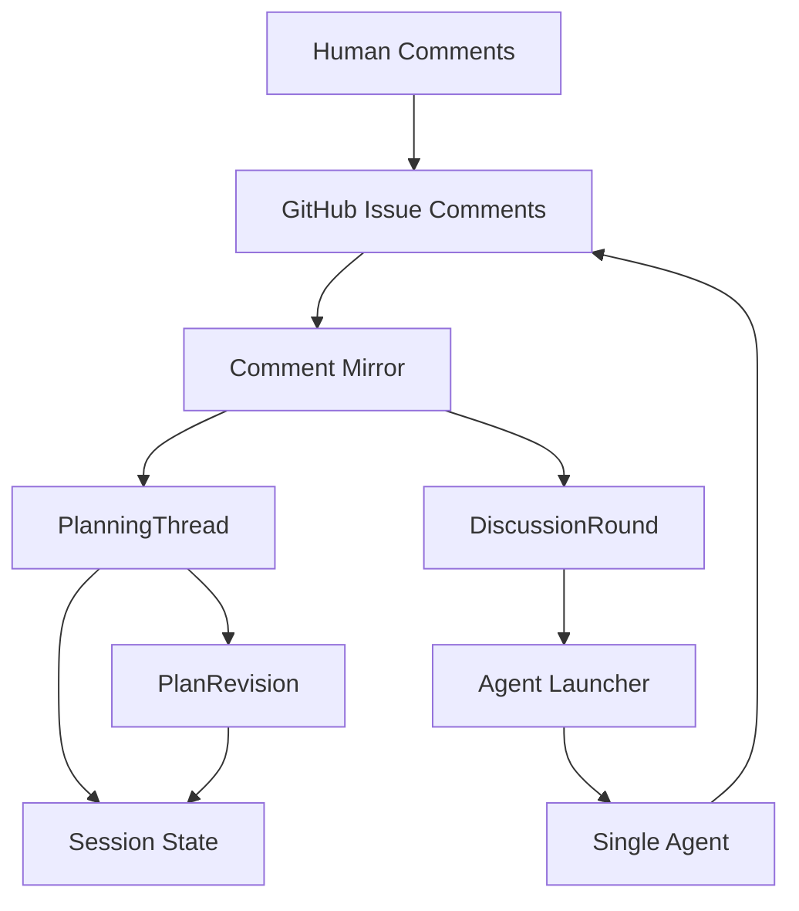
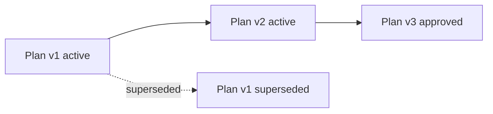
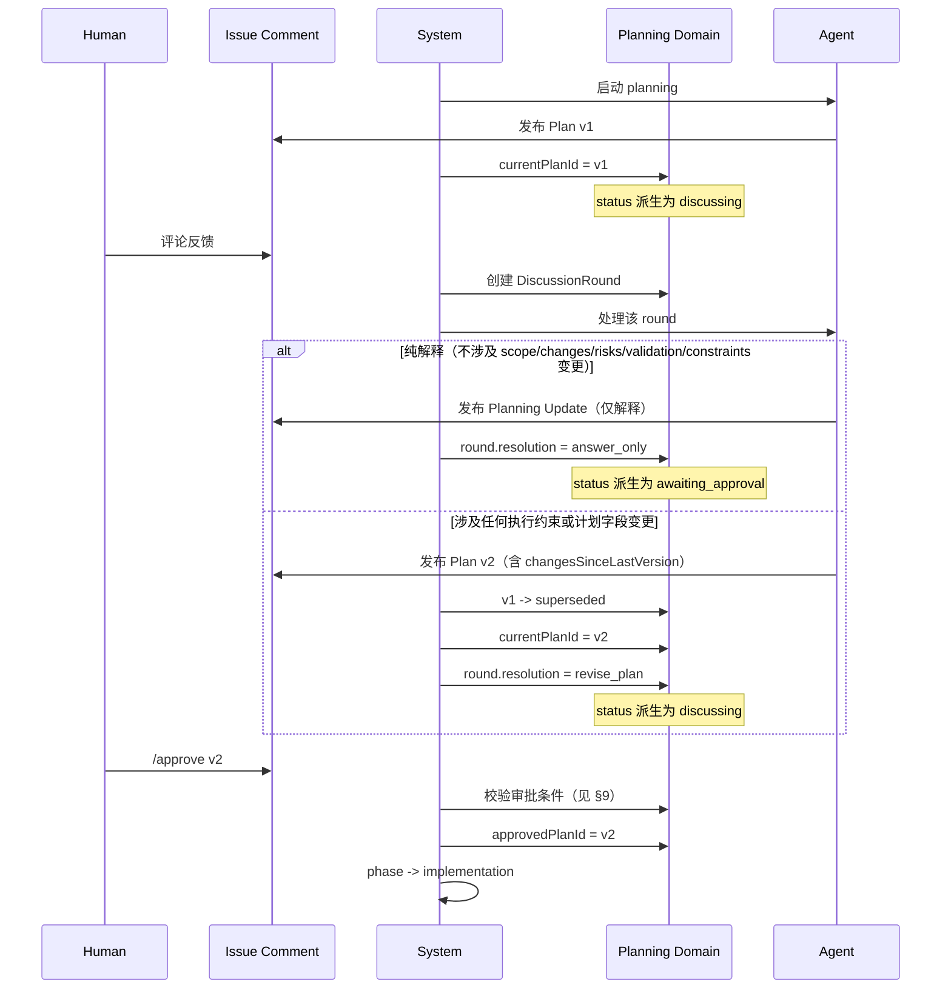
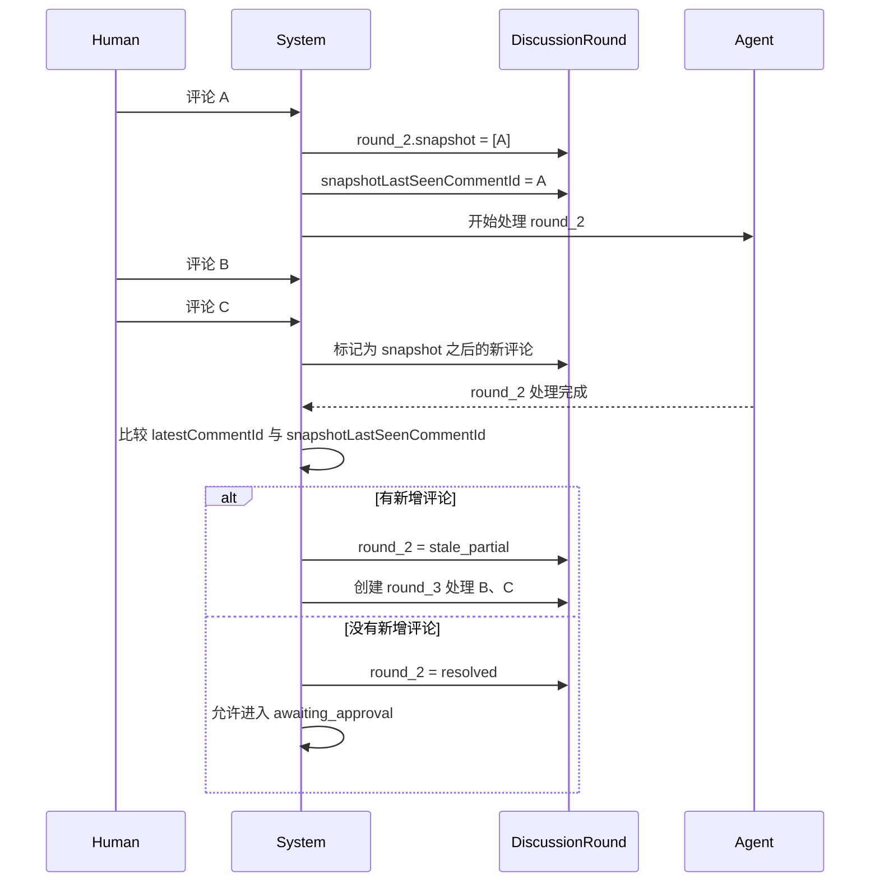
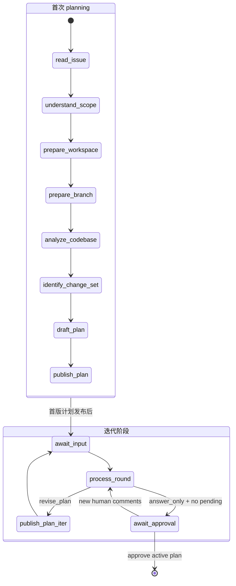
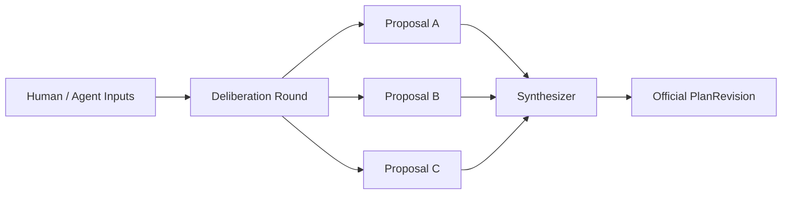

# Planning 阶段交互式收敛架构（单 Agent，可扩展到多 Agent）

## 1. Purpose

本文档定义 Planning 阶段的目标架构，用于支持以下能力：

- Agent 在 Issue 中发布正式计划
- 人类围绕正式计划持续提问、补充约束、要求修改
- Agent 基于讨论轮次进行答疑或修订
- 只有对当前有效正式计划的明确确认，才允许进入 Implementation

本文档只考虑架构和业务合理性，不考虑向下兼容。

当前范围仅覆盖单 Agent；但数据模型需要为后续多 Agent 协商保留稳定扩展位。

## 2. 核心结论

| 关注点 | 设计结论 | 原因 |
|---|---|---|
| 对外协作界面 | 使用 Issue Comment | 直接复用 GitHub 协作习惯 |
| 当前真相源 | 使用内部 Planning Domain | 不能依赖 GitHub 评论回放重建全部状态 |
| 正式计划 | 使用 `PlanRevision` 追加式版本快照 | Implementation 必须绑定单一、稳定的官方版本 |
| 反馈处理 | 使用 `DiscussionRound` 按轮次收敛 | 避免连续评论导致漏处理或频繁抖动 |
| 审批方式 | 仅通过显式版本号或 plan token 绑定 | GitHub Issue Comment 无父子回复关系，reply target 不可靠 |
| 审批 gating | 仅计入授权人类作者的有效反馈 | 避免 bot/agent 评论、edited/deleted 事件阻塞审批 |
| 并发安全 | 乐观锁 + 唯一约束 + 幂等消费 | webhook 重放、并发 agent 等场景下保证不变量 |
| answer_only 边界 | 仅限纯解释，不允许新增执行约束 | 防止约束留在评论里而不进入 official plan |
| 多 Agent 扩展 | 后续新增 `Proposal`，但 official plan 始终单线 | 保证收敛和可执行性 |

## 3. 高层架构



职责边界如下：

| 层 | 职责 | 不负责 |
|---|---|---|
| Issue Comment | 人机协作界面、外部事件流、可审阅文本 | 当前真相状态、完整业务重建 |
| Planning Domain | 当前有效计划、讨论轮次、审批目标、历史快照 | 终端执行进度展示 |
| Session State | `lifecycle / phase / step` 投影 | 存储完整 planning 历史 |

## 4. 核心对象

### 4.1 `PlanningThread`

`PlanningThread` 表示”这个 Issue 当前 planning 讨论到哪里了”。

| 字段 | 含义 |
|---|---|
| `issueNumber` | 关联的 Issue |
| `version` | 乐观锁版本号，每次写入时 +1，用于并发控制（见 §4.4） |
| `status` | 派生字段，由 `currentPlanId` 和 `openRoundId` 计算得出（见下方规则） |
| `currentPlanId` | 当前有效正式计划 |
| `openRoundId` | 当前打开中的讨论轮次 |
| `approvedPlanId` | 已批准的正式计划 |
| `lastProcessedCommentId` | 已完全纳入 planning 处理的最新评论 |
| `updatedAt` | 最近更新时间 |

**`status` 派生规则**（不独立存储，查询时计算，按优先级从高到低匹配）：

| 优先级 | 条件 | 派生 status |
|---|---|---|
| 1 | 显式关闭 | `closed` |
| 2 | `approvedPlanId` 不为空，且无 open round | `approved` |
| 3 | `openRoundId` 不为空，且对应 round 状态为 `open / processing / stale_partial` | `discussing` |
| 4 | `currentPlanId` 不为空，无 open round，无未处理的有效人类评论 | `awaiting_approval` |
| 5 | `currentPlanId` 为空 | `drafting` |

注意：`approved` 后如果出现新的 open round（用户在 approve 后又发了评论），系统应先关闭当前 approved 状态、回退到 discussing，再处理新 round。即 `approved` + open round 不应共存。

这消除了 `PlanningThread.status` 与 `DiscussionRound.status` 之间的隐性耦合——thread 状态始终是从 round 和 plan 状态派生的，不存在两者不一致的可能。

它回答的是：

- 当前哪版正式计划有效
- 现在是否还在讨论
- 是否已经批准某个正式计划

### 4.2 `PlanRevision`

`PlanRevision` 表示“一个正式计划版本的不可变快照”。



| 字段 | 含义 |
|---|---|
| `planId` | 正式计划 ID |
| `version` | 版本号，如 `1 / 2 / 3` |
| `basedOnPlanId` | 基于哪一版修订 |
| `status` | `draft \| active \| superseded \| approved \| closed` |
| `commentId` | 对应的 Issue 评论 ID |
| `summary` | 计划摘要 |
| `scope` | 范围 |
| `changes` | 预期修改点 |
| `risks` | 风险 |
| `validation` | 验证方案 |
| `decisionLog` | 关键取舍 |
| `changesSinceLastVersion` | 与上一版的 diff 摘要（首版为空） |
| `createdAt` | 创建时间 |

约束：

- 同一个 Issue 任意时刻只能有一个 `active` 的 `PlanRevision`
- 新版生效后，旧版必须转为 `superseded`
- 只有 `approved` 的 `PlanRevision` 才允许被 Implementation 消费

### 4.3 `DiscussionRound`

`DiscussionRound` 表示“围绕当前正式计划的一轮讨论”。

它不是一条评论，而是一批评论的处理单元。

| 字段 | 含义 |
|---|---|
| `roundId` | 讨论轮次 ID |
| `basedOnPlanId` | 本轮讨论基于哪版正式计划 |
| `snapshotCommentIds` | 本轮启动时纳入处理的评论集合 |
| `snapshotLastSeenCommentId` | 本轮启动时看到的最后一条评论 |
| `status` | `open \| processing \| stale_partial \| resolved \| closed` |
| `resolution` | `answer_only \| revise_plan \| close_planning` |
| `producedPlanId` | 若本轮产出新正式计划，则记录该计划 |
| `createdAt` | 创建时间 |
| `resolvedAt` | 解决时间 |

它回答的是：

- 哪些评论属于同一轮讨论
- 这一轮是只答疑，还是要修订计划
- 这一轮是否已经处理完

### 4.4 `CommentMirror`

`CommentMirror` 是基础设施层的本地缓存，不参与业务状态决策。

| 字段 | 含义 |
|---|---|
| `commentId` | GitHub Issue Comment ID（即 `issue_comment.id`） |
| `issueNumber` | 关联的 Issue |
| `authorLogin` | 评论作者 |
| `authorType` | `human \| bot`（用于审批 gating 过滤，见 §9.3） |
| `body` | 评论原文 |
| `createdAt` | GitHub 侧创建时间 |
| `mirroredAt` | 本地镜像时间 |

职责边界：

- **负责**：缓存 GitHub 评论原文，供 `DiscussionRound` 构建快照时引用，避免重复调用 GitHub API
- **不负责**：业务状态判断。`DiscussionRound.snapshotCommentIds` 引用的是 GitHub `commentId`，CommentMirror 只是让这些 ID 可以在本地解析为评论内容。如果 Mirror 缺失，可以回退到 GitHub API 拉取

### 4.5 并发安全机制

Planning Domain 的不变量（同一时刻只有一个 active plan、不能有未处理 round 才能 approve）在 webhook 重放、重复拉起 agent、agent 处理完成和新评论同时到达等场景下会面临竞态。以下三个机制共同保证一致性：

| 机制 | 作用 | 落地方式 |
|---|---|---|
| 乐观锁版本号 | 防止并发写入覆盖 | `PlanningThread.version`：每次写入时 `WHERE version = ?`，失败则重读重试 |
| 唯一约束 | 防止双 active plan / 双 open round | DB 层 partial unique index：`UNIQUE(issue_number) WHERE status = 'active'`（plan）、`UNIQUE(issue_number) WHERE status IN ('open','processing','stale_partial')`（round） |
| 幂等消费键 | 防止 webhook 重放导致重复处理 | 按 `issue_comment.id` 或 webhook delivery `X-GitHub-Delivery` header 做去重，已处理的事件直接跳过 |

这三个机制与现有 `db.ts` 的 `transactSession()` 事务模式一致——在 SQLite WAL 模式下，乐观锁 + 事务足以覆盖单进程内的并发；跨进程场景由 `PRAGMA busy_timeout = 5000` 和 `issueLocks` 队列（`webhook-handlers.ts`）保证串行化。

## 5. 为什么不用”评论类型”做主模型

Issue 评论经常是混合意图：

- 同时提问
- 同时补充约束
- 同时要求修改

因此系统不应把 `question / constraint / change_request` 作为强约束主模型。更合理的做法是：

- 保留原始评论镜像 `CommentMirror`
- 真正的处理单元是 `DiscussionRound`

换句话说：

- 评论是原始输入
- Round 是业务处理单元
- PlanRevision 是正式输出

### 5.1 `answer_only` 的严格边界

`DiscussionRound.resolution = answer_only` **仅允许用于纯解释性回复**——即不改变 scope、changes、risks、validation、accepted constraints 中任何一项的回复。

如果 Agent 在处理 round 时发现反馈包含以下任一类型，则 **必须** 产出新的 `PlanRevision`，resolution 必须为 `revise_plan`：

| 反馈类型 | 示例 | 为什么不能 answer_only |
|---|---|---|
| 新增执行约束 | “不能引入 MQ” | 约束会影响实现，必须进入 official plan |
| 修改范围 | “前端也要改” | scope 变更 |
| 新增风险 | “这个方案在高并发下有问题” | risks 变更 |
| 修改验证方案 | “需要加压测” | validation 变更 |

**原因**：如果允许 `answer_only` 的 Planning Update 评论中记录 Accepted Constraints，而 implementation 只消费 approved PlanRevision，那么这些约束会丢失。这是最大的业务语义漏洞——用户以为约束已被接受，但实现阶段拿到的仍是旧计划。

系统应在 Agent 提交 round resolution 时校验：如果回复文本中包含对 plan 字段的实质性变更承诺，拒绝 `answer_only` 并要求 Agent 产出新版本。

## 6. 单 Agent 正常流程



## 7. 连续评论不漏处理

这是 Planning 设计里最容易被忽略、但最关键的一点。

### 7.1 典型场景

用户连续发送 3 条评论：

- A：不能引入 MQ
- B：前端不要轮询
- C：需要失败重试

如果系统在收到 A 后立刻启动 Agent，而 B、C 在 Agent 处理中才到达，那么系统必须保证 B、C 不会被遗漏。

### 7.2 处理机制



### 7.3 两条必须成立的不变量

| 不变量 | 说明 |
|---|---|
| 每次 Agent 处理都必须绑定 `snapshotLastSeenCommentId` | Agent 处理的是稳定快照，而不是不断变化的评论流 |
| 在进入 `awaiting_approval` 前，必须确认不存在比该快照更新的未处理评论 | 防止漏掉 B、C 这类后到评论 |

### 7.4 推荐策略

默认策略应为：

1. Agent 基于固定快照处理当前 round
2. 处理结束前检查是否出现更新评论
3. 若有，则当前 round 标记为 `stale_partial`
4. 新建下一轮 round 继续处理增量评论

不建议默认在评论到达时立即打断 Agent；那会导致 planning 抖动过大。

### 7.5 收敛保证

连续 `stale_partial` 理论上可以无限循环（用户持续发送评论）。为保证收敛：

| 策略 | 规则 |
|---|---|
| 最大连续 stale_partial 次数 | 默认 3 次。超过后，系统将所有未处理评论合并到一个 round，不再拆分增量 |
| 合并 round 的快照范围 | 从第一个 stale_partial round 的 `snapshotLastSeenCommentId` 之后的所有评论，到当前最新评论 |
| 合并后行为 | Agent 基于合并快照一次性处理，处理完成后正常进入 resolved 或 revise_plan |

这保证了即使用户持续发送评论，系统最多经过 N+1 轮（N = 最大连续次数）就会收敛到一个完整处理。

## 8. Session State 映射

Planning Domain 是真相源；Session State 只做投影。

建议的 `planning` 阶段 step 分为两类：

**首次 planning 线性步骤**（从 Issue 到首版计划发布，顺序执行）：

| Step | Lifecycle | 说明 |
|---|---|---|
| `read_issue` | `running` | 读取 Issue |
| `understand_scope` | `running` | 理解需求和边界 |
| `prepare_workspace` | `running` | 准备工作区 |
| `prepare_branch` | `running` | 准备分支 |
| `analyze_codebase` | `running` | 理解当前实现 |
| `identify_change_set` | `running` | 收敛改动范围 |
| `draft_plan` | `running` | 整理正式计划 |
| `publish_plan` | `running` | 发布 `PlanRevision` |

**迭代阶段循环步骤**（计划发布后，可多次循环）：

| Step | Lifecycle | 说明 |
|---|---|---|
| `await_input` | `waiting_human` | 等待用户反馈或补充约束 |
| `process_round` | `running` | 处理当前讨论轮次 |
| `publish_plan` | `running` | 发布修订后的 `PlanRevision`（复用同一 step） |
| `await_approval` | `waiting_human` | 当前无待处理评论，等待批准 |

推荐状态流转：



说明：

- `await_input` 表示“可以继续讨论，但当前还没有启动新一轮处理”
- `await_approval` 表示“当前没有未处理评论，且当前正式计划已准备好等待批准”
- 不应再在 `session.context` 中重复维护 `planningStatus`

## 9. 审批设计

### 9.1 审批目标必须通过显式标识符绑定

GitHub Issue Comment REST API 和 `issue_comment` webhook payload 中没有可依赖的评论父子回复关系（`in_reply_to_id` 仅存在于 PR review comment，不存在于 issue comment）。因此 **不能** 依赖”回复某条正式计划评论”来绑定审批目标。

唯一正式的审批方式：

| 方式 | 格式 | 说明 |
|---|---|---|
| 显式版本号 | `/approve v2` | 通过版本号绑定目标计划 |
| 显式 plan token | `/approve plan:abc123` | 通过 planId 绑定目标计划 |
| 裸 `/approve`（受限） | `/approve` | 仅当同时满足：只有一个 active plan、无 open round、无未处理有效人类评论时，自动绑定当前 active plan |

系统内部最终都必须归一化为”批准 `planId=X`”。

评论中的 plan comment URL 可以作为辅助信息展示，但 **不能** 作为审批目标的主绑定依据。

### 9.2 审批通过条件

只有同时满足以下条件，审批才生效：

| 条件 | 说明 |
|---|---|
| 当前 Phase 为 `planning` | 不允许跨阶段批准 |
| 目标 `planId` 存在且等于 `currentPlanId` | 只能批准当前有效正式计划（`currentPlanId` 定义上指向唯一 active plan，无需额外校验 status） |
| 当前不存在 `open / processing / stale_partial` 的 round | 不能带着未处理讨论进入实现 |
| 不存在未处理的有效人类反馈（见 §9.3） | 防止用户刚追加约束就误进入 implementation |

审批成功后：

- `PlanRevision.status = approved`
- `PlanningThread.approvedPlanId = currentPlanId`
- Session 从 `planning` 进入 `implementation.sync_approved_plan`

### 9.3 “未处理评论” gating 的精确定义

原始规则”不存在更新的未处理评论”过于笼统，会导致 agent 自身评论、bot 评论、评论编辑/删除事件阻塞审批。精确定义如下：

**纳入 gating 的评论**必须同时满足：

| 维度 | 规则 |
|---|---|
| 作者类型 | 仅授权人类作者（排除 agent/bot 账号，通过 `sender.type` 或维护的 bot 账号列表判断） |
| 事件类型 | 仅 `issue_comment` 的 `created` action（`edited` 和 `deleted` 不纳入 gating） |
| 时间窗口 | 在”目标 plan 发布后、审批命令出现前”创建的评论 |
| 处理状态 | 尚未被任何 `resolved` 状态的 `DiscussionRound` 覆盖（即 `commentId > lastProcessedCommentId`） |

**不纳入 gating 的评论**：

- Agent/bot 自身发布的评论（包括 plan comment、planning update comment）
- `edited` / `deleted` 事件（GitHub `issue_comment` webhook 会对同一条评论触发 created/edited/deleted 三种 action，只有 created 代表新信息）
- 审批命令本身（`/approve` 评论不应阻塞自己）
- 已被 resolved round 覆盖的评论

**`edited` / `deleted` 的处理策略**：

- `edited`：如果被编辑的评论已被某个 resolved round 处理过，记录一条 warning 日志但不重新打开 round（编辑后的内容可能已经不影响计划）。如果需要重新处理，用户应发新评论。
- `deleted`：忽略。已处理的评论被删除不影响已产出的 plan revision。

## 10. 存储建议

推荐最少分为三层：

| 层 | 内容 | 作用 |
|---|---|---|
| `session` | `lifecycle / phase / step / message / context` | 执行态投影 |
| `planning domain store` | `PlanningThread / PlanRevision / DiscussionRound / CommentMirror` | planning 真相源 |
| `github issue comments` | 人机可见评论流 | 协作界面和外部审阅材料 |

设计原则：

- 当前态与历史态分离
- 外部评论流与内部真相态分离
- 不依赖 GitHub Comment 文本回放重建全部业务状态

### 10.1 Planning Domain Store 的并发安全约束

存储层必须强制执行 §4.5 中定义的三层并发安全机制（乐观锁、唯一约束、幂等消费键）。这些约束不能仅靠应用层逻辑保证，必须落地为 DB 层的 partial unique index、version check 和去重表。

## 11. 正式评论模板建议

### 11.1 Official Plan Comment

```md
## Plan v2

### Changes Since v1
- Added: failure retry requirement (from discussion round #2)
- Removed: MQ dependency (constraint from user)

### Scope
- ...

### Changes
- ...

### Risks
- ...

### Validation
- ...

### Accepted Constraints
- 不能引入 MQ（来源：用户反馈）
- 必须支持失败重试（来源：用户反馈）

### Decision Log
- Accepted: ...
- Rejected: ...
```

### 11.2 Planning Update Comment（仅限纯解释）

```md
## Planning Update

### Answered
- Q: 为什么选择方案 A？
  A: 因为方案 B 在高并发下有性能瓶颈...

### Next Status
- Current official plan: v2
- Current state: awaiting approval

> 注意：本次更新仅包含解释，未修改计划内容。如需补充约束或修改范围，请发新评论。
```

Planning Update **不允许** 包含 Accepted Constraints 或任何对 plan 字段的变更承诺。如果 Agent 需要接受新约束，必须产出新的 PlanRevision。

## 12. Failure Semantics

以下情况不应直接视为失败：

- 用户对当前计划提出异议
- 用户补充新约束
- 用户要求进一步解释
- 用户要求重新整理计划

更合理的处理方式是：

- 创建或继续处理 `DiscussionRound`
- 根据 round 结果决定答疑或修订

以下情况才适合进入 `failed` 或显式终止：

- Planning Domain 状态损坏，无法识别当前有效正式计划
- 多轮讨论后仍无法满足明确约束，且系统决定终止
- 用户明确执行 `/close-planning`

## 13. 未来多 Agent 扩展说明

当前版本只实现单 Agent，但应保留以下扩展面。

### 13.1 扩展原则



三条原则必须始终成立：

| 原则 | 说明 |
|---|---|
| `Proposal` 可以并行 | 多个 agent 可以各自提出候选方案 |
| `Official PlanRevision` 必须单线 | 任意时刻只能有一个当前有效正式计划 |
| `approve` 只作用于 official plan | 人或系统都不能直接批准某个 proposal |

### 13.2 未来新增对象

后续若扩展到多 Agent，只需新增 `Proposal`：

| 字段 | 含义 |
|---|---|
| `proposalId` | 候选方案 ID |
| `roundId` | 所属 deliberation round |
| `basedOnPlanId` | 基于哪版 official plan 讨论 |
| `authorType / authorId` | 提案角色 |
| `summary` | 候选方案摘要 |
| `status` | `proposed \| accepted \| rejected \| superseded` |

扩展后的职责保持不变：

- `PlanningThread` 仍然管理当前真相
- `PlanRevision` 仍然管理官方版本历史
- `DiscussionRound` 可升级为 `DeliberationRound`
- `Proposal` 只承担多方候选方案表达，不替代 official plan

## 14. Summary

单 Agent Planning 的合理架构应满足以下要求：

- Issue Comment 负责协作界面，不负责单独承载全部业务真相
- 正式计划以 `PlanRevision` 追加式版本快照存在，新版本必须附带 `changesSinceLastVersion`
- 评论处理以 `DiscussionRound` 为单位，而不是逐条评论直接驱动状态机
- 连续评论必须通过”快照 + 复查增量”机制保证不漏处理，且通过最大连续 stale_partial 次数保证收敛
- `answer_only` 仅限纯解释，凡涉及执行约束或计划字段变更的反馈必须产出新 PlanRevision
- 审批必须通过显式版本号或 plan token 绑定当前有效正式计划（GitHub Issue Comment 无父子回复关系，不能依赖 reply target）
- 审批 gating 仅计入授权人类作者在目标 plan 发布后创建的有效反馈，agent/bot 评论和 edited/deleted 事件不阻塞
- 并发安全通过乐观锁版本号、唯一约束、幂等消费键三层机制保证，与现有 SQLite WAL + transactSession 模式兼容
- `PlanningThread.status` 从 round 和 plan 状态派生计算，不独立存储，消除隐性耦合
- 后续扩展到多 Agent 时，只允许 proposal 并行，official plan 必须单线收敛

这套模型先服务单 Agent 的交互式 planning，并为未来多 Agent 协商保留清晰扩展面。
